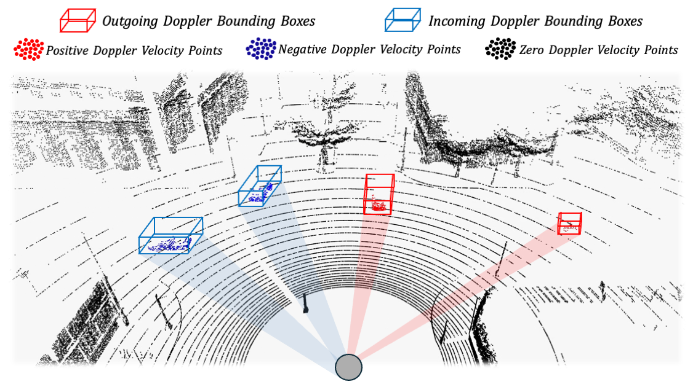

# ROS/ROS2 bridge for CARLA simulator with Doppler LiDAR support

[](https://github.com/UUwei-zuo/ros-bridge-DopplerLiDAR/blob/master/LICENSE)
[](https://github.com/UUwei-zuo/ros-bridge-DopplerLiDAR)
[](https://github.com/UUwei-zuo/ros-bridge-DopplerLiDAR)

[ROS bridge](https://github.com/carla-simulator/ros-bridge?tab=readme-ov-file) enables two-way communication between [ROS](https://wiki.ros.org/ROS/Installation) and [CARLA](https://github.com/carla-simulator/carla).
**This fork includes the enhanced Doppler LiDAR support, which provides Doppler velocity measurements.**

### Doppler LiDAR Features
- **🚀️The 4th Measuring dimension**: Doppler LiDAR directly captures point dynamics by Doppler velocity besides traditional ranging measurements. 
This is based on the [Doppler Effect](https://en.wikipedia.org/wiki/Doppler_effect).
- **☁️Enhanced Point Cloud**: Doppler velocity is now included for each point before sent to ROS topic, facilitating advanced environmental perception for a broad range of applications.

|                                                           | 
|:----------------------------------------------------------------------------------------------------:| 
| *An example of using Doppler LiDAR for motion planning: [DPNet](https://github.com/UUwei-zuo/DPNet)* |


❗️*This bridge requires CARLA simulator with Doppler LiDAR plugin, provided by [CARLA-AEVA](https://github.com/aevainc/carla-aeva). Make sure to use it instead of the standard [CARLA](https://github.com/carla-simulator/carla) for Doppler LiDAR functionality.* 

## Quick Start (ROS1 Noetic on Ubuntu 20.04)

### Prerequisites
- Ubuntu 20.04
- [CARLA-AEVA](https://github.com/aevainc/carla-aeva)
- [ROS Noetic](https://wiki.ros.org/ROS/Installation) installed and configured

### Installation & Setup

```bash
# 1. Create catkin workspace
mkdir -p ~/carla-ros-bridge/catkin_ws/src
cd ~/carla-ros-bridge

# 2. Clone this repository with Doppler LiDAR support
git clone --recurse-submodules https://github.com/UUwei-zuo/ros-bridge-DopplerLiDAR.git catkin_ws/src/ros-bridge

# 3. Set up ROS environment
source /opt/ros/noetic/setup.bash 

# 4. Install ROS dependencies
cd catkin_ws
rosdep update
rosdep install --from-paths src --ignore-src -r

# 5. Build the ROS bridge
catkin build

# 6. Source the workspace
source devel/setup.bash
```

Next, follow the [official documentation](https://carla.readthedocs.io/projects/ros-bridge/en/latest/ros_installation_ros1/) to run CARLA and launch the ROS bridge.

### Using Doppler LiDAR

The Doppler LiDAR sensor provides velocity measurements in addition to standard LiDAR data:

- **Topic**: `/carla/ego_vehicle/doppler_lidar/point_cloud`
- **Fields**: x, y, z, azimuth, elevation, range, intensity, velocity, valid
- **Velocity**: Radial velocity in m/s using Doppler effect
- **Type ID**: `sensor.lidar.doppler`

*Notes:* 

*This fork is currently developed and tested on ROS1 Noetic. ROS2 support may be available in future updates. Issues and contributions are welcome (contact: [zuowei@eee.hku.hk](mailto:zuowei@eee.hku.hk))*

